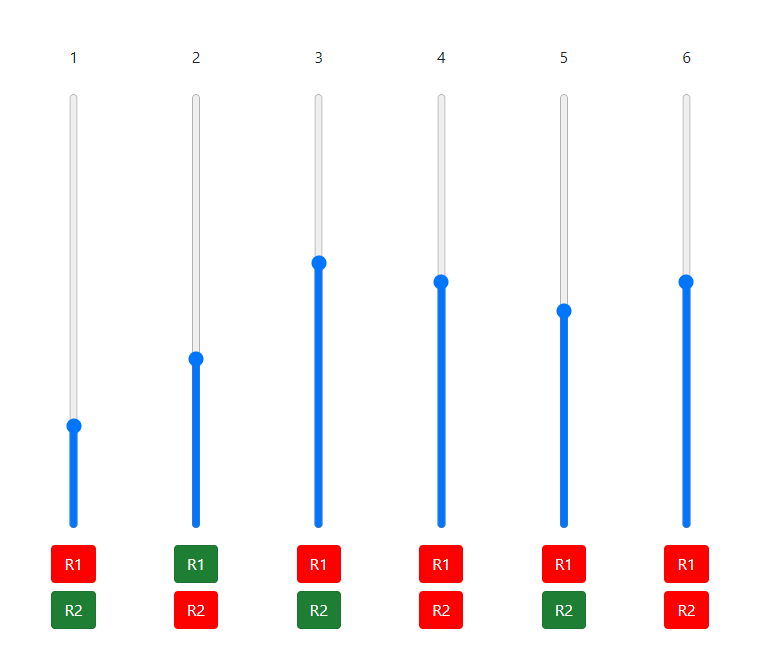

# serialmix

Web application for audio mix control. 



There are two services:

* Rest API on port 5000 
* Web app on port 80

## Rest API

Is stored in `rest/rest.py`. All the serial communication and setup is done here.

## The web service

The web service

# Install on Raspberry Pi 4


```bash
sudo pip3 install flask_cors flask pyserial
git clone https://github.com/mjirik/serialmix.git
sudo cp /home/pi/serialmix/systemd/serialmixweb.service /lib/systemd/system/
sudo chmod 644 /lib/systemd/system/serialmixweb.service
sudo cp /home/pi/serialmix/systemd/serialmixrest.service /lib/systemd/system/
sudo chmod 644 /lib/systemd/system/serialmixrest.service

sudo systemctl daemon-reload
sudo systemctl enable serialmixweb.service
sudo systemctl enable serialmixrest.service
```

Check the ip of the device and restarat
```bash
ifconfig
sudo reboot
```

after

Serial port message calculator
https://support.biamp.com/Audia-Nexia/Control/Audia-Nexia_command_string_calculator?fbclid=IwAR2jkVR19XUBua7yoSb9My9W9Np6GKJOU8cXyc6UaRtSI1RSVpYwiWMZB0w


# Debug

## From Raspberry
```bash
sudo apt install multitail
multitail ~/serialmix/web*.log
```

## Using web

You can download log using web interface
```bash
<IP Adress>/serialmixrest.log
<IP Adress>/serialmixweb.log
```